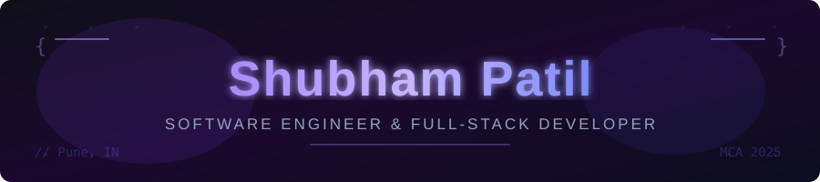

<div align="center">

<!-- 
  SETUP: Upload banner.svg to your repo root, then this image will work perfectly.
  It is included in this download as banner.svg
-->


<br/>


<br/><br/>

<a href="https://shubham-patil-portfolio.vercel.app"></a>&nbsp;
<a href="https://www.linkedin.com/in/shubhampatil20/"></a>&nbsp;
<a href="mailto:shubhampatil6502@gmail.com"></a>&nbsp;
<a href="https://github.com/Shubham6502"></a>&nbsp;


</div>

<br/>

---

### 👾 &nbsp;`whoami`

<table>
<tr>
<td width="52%">

```typescript
const shubham: Developer = {
  name:      "Shubham Patil",
  title:     "Software Engineer & Full-Stack Developer",
  education: "MCA @ Dr. D.Y. Patil, Pune",
  location:  "Pune, Maharashtra 🇮🇳",
  stack:     ["MongoDB","Express","React","Node.js"],
  focus:     ["Backend Eng", "System Design", "DSA"],
  status:    "🟢 Open to SWE Opportunities",
};
```

**What I'm working on:**
- 🚀 Scaling **CareerCompass** to production
- 🧠 Grinding DSA & System Design daily
- 🏗️ Building scalable REST APIs
- 💡 Turning ideas into real products

</td>
<td width="48%" align="center">


</td>
</tr>
</table>

---

### 🧠 &nbsp;`engineering.philosophy`

<table>
<tr>
<td width="48%">

```javascript
// How I think about software
const principles = {
  build:  "Real products > Tutorial clones",
  think:  "Architecture before code",
  write:  "Code your team will thank you for",
  ship:   "Done > perfect, then iterate",
  grow:   "Compound 1% every single day",
};
```

</td>
<td width="52%">

| Value | How it shows up |
|-------|----------------|
| 🏗️ **Build Real** | Production-style projects only |
| 🧠 **Think Systems** | Design before implementation |
| ✍️ **Write Clean** | Readable, maintainable, reviewable |
| 🔄 **Ship Fast** | MVP → feedback → improve loop |
| 📈 **Stay Consistent** | Show up every day, no excuses |

</td>
</tr>
</table>

---

### 🛠️ &nbsp;`tech.stack`

<div align="center">

**Languages**


**Frontend**


**Backend & Databases**


**Tools & Workflow**


</div>

---

### 🚀 &nbsp;`projects.featured`

<details open>
<summary>&nbsp;<b>🧭 CareerCompass — Career Guidance Platform</b></summary>
<br/>

> Helps students stay consistent by generating domain-specific daily learning tasks, tracking streaks, and competing on leaderboards — bridging the gap between "I want to learn" and "I actually did."

<table>
<tr><td>

```
🔷 Stack  →  MongoDB · Express.js · React.js · Node.js
🔷 Type   →  Full Stack Web Application
🔷 Domain →  EdTech · Productivity · Career Dev
```

</td><td>

| Feature | |
|---------|--|
| 📋 Domain-based roadmap | ✅ |
| ⚡ Daily task engine | ✅ |
| 🔥 Streak tracker | ✅ |
| 🏆 Leaderboard | ✅ |
| 💼 Job app tracker | ✅ |

</td></tr>
</table>

<a href="https://github.com/Shubham6502/CareerCompas"></a>

</details>

---

<details>
<summary>&nbsp;<b>💎 Jewellery E-Commerce Platform</b></summary>
<br/>

> Full-stack e-commerce platform architected like a real online store — product catalog, cart, responsive UI, and complete backend integration. Not a clone. A proper build.

<table>
<tr><td>

```
🔷 Stack  →  MERN Stack
🔷 Type   →  E-Commerce Application
🔷 Domain →  Full Stack · UX · Backend
```

</td><td>

| Feature | |
|---------|--|
| 🛍️ Product catalog | ✅ |
| 🛒 Shopping cart | ✅ |
| 📱 Responsive UI | ✅ |
| 🔗 Backend integration | ✅ |

</td></tr>
</table>

<a href="https://github.com/Shubham6502/Jwellery-Shop"></a>

</details>

---

<details>
<summary>&nbsp;<b>📚 Study Room — Collaborative Learning Platform</b></summary>
<br/>

> A collaborative space for students to join study rooms, stay accountable, and learn together in a structured environment.

<table>
<tr><td>

```
🔷 Stack  →  MERN Stack
🔷 Type   →  Collaborative Web App
🔷 Domain →  Community · Productivity
```

</td><td>

| Feature | |
|---------|--|
| 🏠 Study rooms | ✅ |
| 📖 Structured env | ✅ |
| 🎯 Productivity tools | ✅ |

</td></tr>
</table>

<a href="https://github.com/Shubham6502/study_room"></a>

</details>

---

### 📊 &nbsp;`github.stats`

<div align="center">


<br/>


<br/>


</div>

---

### ⚡ &nbsp;`current.sprint`

```bash
$ cat current-sprint.log

  [▶ ACTIVE]  Scaling CareerCompass → production-ready architecture
  [▶ ACTIVE]  DSA daily practice — arrays, trees, graphs, DP
  [▶ ACTIVE]  REST API design patterns & backend best practices
  [▶ ACTIVE]  System Design fundamentals (HLD / LLD)
  [◉ QUEUED]  Open Source first contribution
  [◉ QUEUED]  TypeScript migration in projects
```

---

### 🤝 &nbsp;`connect`

<div align="center">

**I build things that matter. Let's work together.**

<br/>

<a href="https://shubham-patil-portfolio.vercel.app">
  
</a>

<br/><br/>

<a href="https://www.linkedin.com/in/shubhampatil20/">
  
</a>&nbsp;
<a href="mailto:shubhampatil6502@gmail.com">
  
</a>&nbsp;
<a href="https://github.com/Shubham6502">
  
</a>

<br/><br/>

---

```
  ⭐  Always Learning.  Always Building.  Always Shipping.  ⭐
```

</div>
